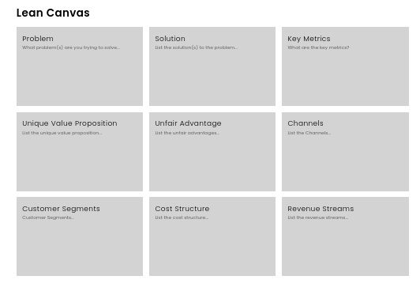

## DESCRIPTION:
- A Lean Canvas App, made with React.

## OUTCOME:
### VERSION 1 (branch: main)
- Lean canvas app
- Features:
    - 100% responsive

## TECH STACKS:
- React
- Hooks: useState
- styling: CSS with BEM naming convention

## PROGRESS:
- well... 100%???
- I've lost my vision for this project. hmmmm...

## How to run
`yarn install`
`yarn start`

## View other projects:
- [My Blog](https://hashnode.com/@marizoo)
- [My Pinterest](https://pin.it/16vGwjy)
- [My Youtube Channel](https://www.youtube.com/channel/UCfkbnM9WvHD3mjecBiGHCBQ/playlists)

## IMAGE:

